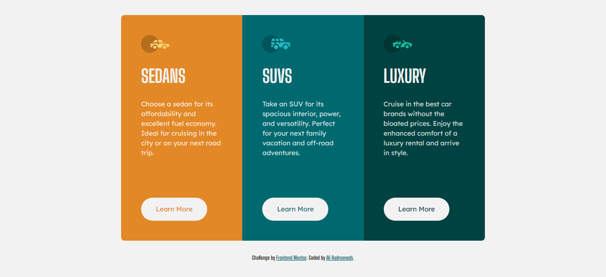

# Frontend Mentor - 3-column preview card component solution

This is a solution to the [3-column preview card component challenge on Frontend Mentor](https://www.frontendmentor.io/challenges/3column-preview-card-component-pH92eAR2-). Frontend Mentor challenges help you improve your coding skills by building realistic projects.

## Table of contents

- [Overview](#overview)
  - [The challenge](#the-challenge)
  - [Screenshot](#screenshot)
  - [Links](#links)
- [My process](#my-process)
  - [Built with](#built-with)
  - [What I learned](#what-i-learned)
  - [Continued development](#continued-development)
  - [Useful resources](#useful-resources)
- [Author](#author)
- [Acknowledgments](#acknowledgments)

## Overview

### The challenge

Users should be able to:

- View the optimal layout depending on their device's screen size
- See hover states for interactive elements

### Screenshot

|                                                    Desktop                                                     |                                                    Mobile                                                    |
| :------------------------------------------------------------------------------------------------------------: | :----------------------------------------------------------------------------------------------------------: |
|  |  |

### Links

- Solution URL: [Github.com/AliRadmanesh](https://github.com/AliRadmanesh/frontendmentor-challenges/tree/main/newbie/3-column-preview-card-component)
- Live Site URL: [AliRadmanesh.github.io](https://aliradmanesh.github.io/frontendmentor-challenges/newbie/3-column-preview-card-component/)

## My process

### Built with

- Semantic HTML5 markup
- CSS custom properties
- Flexbox
- Mobile-first workflow

### What I learned

In this challenge I learned more about CSS selectors like `:nth-child()` and I also use `calc()` function for calculating spacing properly.

## Author

- Website - [Radmanesh.me](https://www.radmanesh.me)
- Frontend Mentor - [@AliRadmanesh](https://www.frontendmentor.io/profile/AliRadmanesh)
- Twitter - [@Ali_Radmanesh95](https://twitter.com/Ali_Radmanesh95)
- Linkedin - [Ali Radmanesh](https://www.linkedin.com/in/ali-radmanesh-71038a131/)
