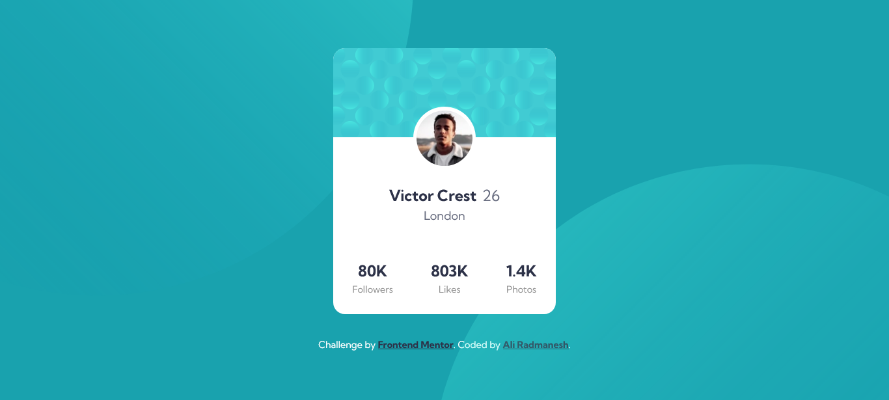
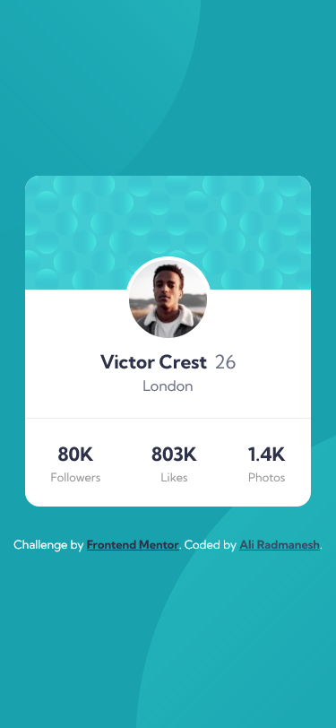

# Frontend Mentor - Profile card component solution

This is a solution to the [Profile card component challenge on Frontend Mentor](https://www.frontendmentor.io/challenges/profile-card-component-cfArpWshJ). Frontend Mentor challenges help you improve your coding skills by building realistic projects. 

## Table of contents

- [Overview](#overview)
  - [The challenge](#the-challenge)
  - [Screenshot](#screenshot)
  - [Links](#links)
- [My process](#my-process)
  - [Built with](#built-with)
  - [What I learned](#what-i-learned)
- [Author](#author)

## Overview

### The challenge

- Build out the project to the designs provided

### Screenshot

|                                                    Desktop                                                     |                                                    Mobile                                                    |
| :------------------------------------------------------------------------------------------------------------: | :----------------------------------------------------------------------------------------------------------: |
|  |  |

### Links

- Solution URL: [Github.com/AliRadmanesh](https://github.com/AliRadmanesh/frontendmentor-challenges/tree/main/newbie/profile-card-component)
- Live Site URL: [AliRadmanesh.github.io](https://aliradmanesh.github.io/frontendmentor-challenges/newbie/profile-card-component/)

## My process

### Built with

- Semantic HTML5 markup
- CSS custom properties
- Flexbox
- Mobile-first workflow

### What I learned

This one was a good challenge, because I didn't expect to face any problems doing that but I was wrong! The top and bottom circle patterns challenged me to learn more about positioning (especially `fixed`). I also learn about `absolute` position in `css` and the fact that it follows the rules of its parent and I should make its parent `relative`.

## Author

- Website - [Radmanesh.me](https://www.radmanesh.me)
- Frontend Mentor - [@AliRadmanesh](https://www.frontendmentor.io/profile/AliRadmanesh)
- Twitter - [@Ali_Radmanesh95](https://twitter.com/Ali_Radmanesh95)
- Linkedin - [Ali Radmanesh](https://www.linkedin.com/in/ali-radmanesh-71038a131/)
