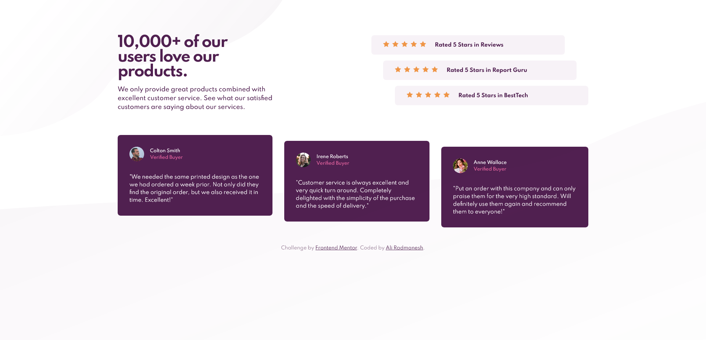
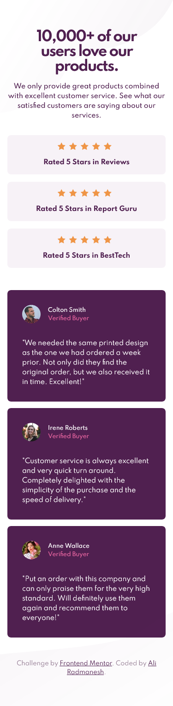

# Frontend Mentor - Social proof section solution

This is a solution to the [Social proof section challenge on Frontend Mentor](https://www.frontendmentor.io/challenges/social-proof-section-6e0qTv_bA). Frontend Mentor challenges help you improve your coding skills by building realistic projects. 

## Table of contents

- [Overview](#overview)
  - [The challenge](#the-challenge)
  - [Screenshot](#screenshot)
  - [Links](#links)
- [My process](#my-process)
  - [Built with](#built-with)
  - [What I learned](#what-i-learned)
  - [Useful resources](#useful-resources)
- [Author](#author)

## Overview

### The challenge

Users should be able to:

- View the optimal layout for the section depending on their device's screen size

### Screenshot

|                                                   Desktop                                                   |                                                  Mobile                                                   |
| :---------------------------------------------------------------------------------------------------------: | :-------------------------------------------------------------------------------------------------------: |
|  |  |

### Links

- Solution URL: [Github.com/AliRadmanesh](https://github.com/AliRadmanesh/frontendmentor-challenges/tree/main/newbie/social-proof-section)
- Live Site URL: [AliRadmanesh.github.io](https://aliradmanesh.github.io/frontendmentor-challenges/newbie/social-proof-section/)

## My process

### Built with

- Semantic HTML5 markup
- CSS custom properties
- Flexbox
- Mobile-first workflow

### What I learned

This challenge is not much challenging! But I got more experience in using flexbox properties.

### Useful resources

- [A Complete Guide to Flexbox](https://css-tricks.com/snippets/css/a-guide-to-flexbox/) - My go-to guide when I got stuck in using flexbox!

## Author

- Website - [Radmanesh.me](https://www.radmanesh.me)
- Frontend Mentor - [@AliRadmanesh](https://www.frontendmentor.io/profile/AliRadmanesh)
- Twitter - [@Ali_Radmanesh95](https://twitter.com/Ali_Radmanesh95)
- Linkedin - [Ali Radmanesh](https://www.linkedin.com/in/ali-radmanesh-71038a131/)
